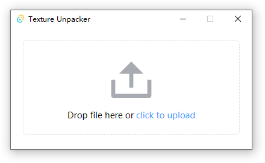

<h1 align="center">
  
Texture Unpacker

</h1>

<h3 align="center">
A cross-platform unpack texture atlases tool built with <a href="https://github.com/tauri-apps/tauri">tauri</a>.
</h3>

## Features

- Support texture pack format 2 and 3
- Support to open file dialog to select files (.plist .png)
- Drag files to the client

## Screenshots

## Install

Download from [release](https://github.com/lzdyes/texture-unpacker/releases). Supports Windows x64, Linux x86_64 and macOS 11+

Or you can build it yourself. Supports Windows, Linux and macOS 10.15+

Notes: If you could not start the app on Windows, please check that you have [Webview2](https://developer.microsoft.com/en-us/microsoft-edge/webview2/#download-section) installed.

